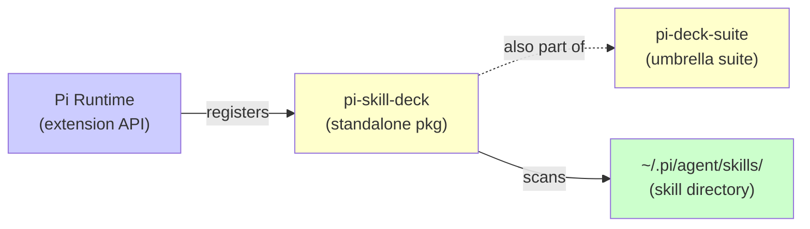

# 📖 ReadMyAss — pi-skill-deck

> Human-readable explanation of `pi-skill-deck` and its place in CymaticAPPS.
> For the visual map see [`PAM_Slave.md`](./PAM_Slave.md).
> For global significance see [`ASS_SLAVE.md`](./ASS_SLAVE.md).
> For project-internal significance see [`PASS.md`](./PASS.md).

**Last synced:** `2026-05-29`

## *You Are Here*

```
🗺️  CymaticAPPS  ─── (Master Map: ../../../.pi/MAPS/ReadMyAss.md)
    ├── 🔔 Agent Infrastructure
    │   ├── pi-skill-deck        ◀── *YOU ARE HERE*  (standalone)
    │   ├── pi-deck-suite        (umbrella suite; pi-skill-deck is also part of this)
    │   └── ...
    └── ...
```

## What is pi-skill-deck?

A **two-pane categorized skill browser for Pi**, accessible via the `/skills` command. It transforms the flat alphabetical wall of 150+ skills into a **navigable, bookmarkable, searchable overlay**.

Features:

- **Category tree (left pane)** — auto-categorized skills grouped by parent dir, name prefix, explicit overrides, and description keywords
- **Detail view (right pane)** — full skill description + `SKILL.md` content + usage stats (frecency)
- **Bookmarks** — save favorite skills (`Ctrl+B` inside overlay)
- **Search** — real-time tag search across skill names + descriptions
- **Frecency tracking** — skills ranked by usage count + recency
- **Daily suggestions** — AI-free picker suggests underused skills
- **Source attribution** — each skill shows its origin (Pi's `~/.pi/agent/skills/`, project-local, npm package, etc.)

## How pi-skill-deck relates to the rest of CymaticAPPS



### In plain English

- **pi-skill-deck is dual-natured** — it exists as both a **standalone npm package** AND as **part of pi-deck-suite** (the multi-deck umbrella)
- **The standalone version** (`CymaticAPPS/pi-skill-deck/`) is a complete Pi extension on its own. You can install it and use `/skills` without needing the suite.
- **The suite version** (`pi-deck-suite/packages/pi-skill-deck/`) is the same project, migrated via git subtree to preserve history. Both versions are canonical simultaneously.
- **It scans the skill ecosystem** — reads from `~/.pi/agent/skills/` + project-local skills + npm packages + 3rd-party extensions
- **It is a DX convenience, not load-bearing** — if it disappears, developers fall back to manual `/skill:<name>` invocation or browsing `~/.pi/agent/skills/` with `cat`

## How to run / use

### Install (standalone)

```bash
pi install npm:pi-skill-deck
```

### Use

```bash
# Inside a Pi session
/skills        # opens the overlay
```

Inside the overlay:
- **Ctrl+B** — bookmark skill
- **Type** — search by name or description
- **Arrow keys** — navigate category tree
- **Enter** — open selected skill's `SKILL.md`

## Where to go next

| If you want to... | Read this |
|-------------------|-----------|
| See what affects the global system | [`ASS_SLAVE.md`](./ASS_SLAVE.md) |
| See what's internally important | [`PASS.md`](./PASS.md) |
| See the visual file map | [`PAM_Slave.md`](./PAM_Slave.md) |
| Go back to the monorepo overview | `../../../.pi/MAPS/ReadMyAss.md` |
| Use the skill browser | `/skills` (inside any Pi session) |
