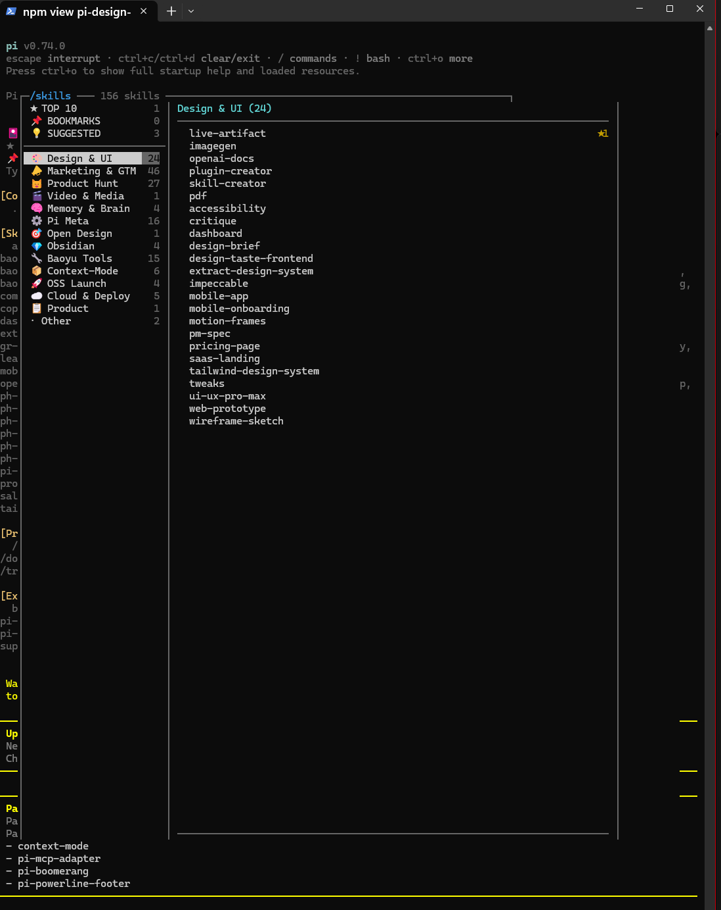

# 🎴 pi-skill-deck

> Two-pane categorized skill browser for [Pi](https://github.com/mariozechner/pi) — replaces the flat alphabetical wall of 150+ skills with a navigable, categorized TUI overlay.

[](https://www.npmjs.com/package/pi-skill-deck)
[](LICENSE)
[](package.json)
[](https://github.com/CymatiStatic/pi-skill-deck)



## ✨ Features

- **Two-pane browser** — sections on the left, skills + detail on the right
- **8 group-by modes** — `g` cycles, `G` opens a picker: **Category** · **Source** · **Framework** · **Creator** · **Location** · **Tag** · **Usage Tier** · **Flat**
- **Source attribution** — every skill carries `source` (pi-agent / claude / codex / npm / agents-pack / project-local), `framework` (SuperClaude / Baoyu / Marketing pack / npm:`<pkg>` / …), and `creator` (baoyu / Anthropic / Corey Haines / Mario Zechner / Ben / …)
- **Inline short summaries** — each row shows skill name + a one-line summary (derived from the SKILL.md description) so you can scan without selecting
- **Expanded DETAILS box** — boxed pane shows category · usage · **source · location** · **framework · creator** · **tags** · full Description block · "What it does" body excerpt
- **`⚠` Thin-body flag** — surfaces skills whose SKILL.md body is missing / sparse so you know which ones still need an explanation written
- **Per-skill tags** — `t` (inline editor) or `T` (modal editor) to apply free-form tags; can be used as a group-by mode
- **★ Top 10 most used** — pinned at the top, ranked by frecency (frequency × recency)
- **📌 Bookmarks** — `Ctrl+B` to save skills for quick access
- **💡 Daily suggestions** — 1–3 underused skills that match your activity patterns, refreshed daily
- **Search** — press `/` to filter skills by name or description in real time
- **Skill queueing** — selected skill is injected alongside your next message
- **Zero config** — scans all standard skill locations automatically

## 📦 Installation

**Requires:** [Pi](https://github.com/mariozechner/pi) ≥ 0.1 and Node.js ≥ 18.

The same `pi install` command works in **any shell** (bash, zsh, PowerShell, cmd.exe, fish, Git Bash, WSL):

### Option 1 — from npm (recommended)

```sh
pi install pi-skill-deck
```

Pi resolves the package name against the npm registry, downloads it, and wires the `/skills` command automatically.

### Option 2 — from GitHub directly

For the very latest commit (may be ahead of npm):

```sh
pi install CymatiStatic/pi-skill-deck
```

### Option 3 — manual settings

If you prefer to edit `~/.pi/agent/settings.json` yourself, add **one** of these to the `packages` array and restart Pi:

```json
{
  "packages": [
    "npm:pi-skill-deck"
  ]
}
```

or

```json
{
  "packages": [
    "github:CymatiStatic/pi-skill-deck"
  ]
}
```

### Verify the install

| Shell | Command |
|-------|---------|
| bash / zsh / Git Bash / WSL | `pi --version && pi extensions list \| grep pi-skill-deck` |
| PowerShell / pwsh | `pi --version; pi extensions list \| Select-String pi-skill-deck` |
| cmd.exe | `pi --version && pi extensions list \| findstr pi-skill-deck` |

Then start a new Pi session and type `/skills`. You should see a one-line `🎴 Skill Deck: N skills loaded` notice at session start.

### Uninstall

```sh
pi uninstall pi-skill-deck
```

or remove the corresponding entry from `~/.pi/agent/settings.json` `packages` array.

### Updating

```sh
pi install pi-skill-deck@latest
```

or pull a specific version (e.g., `pi install pi-skill-deck@0.1.1`).

## 🚀 Usage

Type `/skills` inside any Pi session to open the browser.

### Keyboard shortcuts (inside overlay)

Key hints are always visible in **three places** so you never have to remember them:

- Inline in the **header** — the current group-by mode shows `[g]/[G] change [?] help` right next to it
- Inline in the **DETAILS box** — the tags row shows `[t] inline [T] modal`
- In the **footer status bar** — every key is in a cyan `[...]` chip

And `?` opens a full **Keyboard reference** panel from anywhere.

| Key | Action |
|-----|--------|
| `Tab` / `← →` | Switch focus between panes |
| `↑ ↓` | Navigate within the focused pane |
| `Enter` | Queue the selected skill for your next message |
| `Ctrl+B` | Toggle bookmark on highlighted skill |
| `g` | Cycle group-by mode (Category → Source → Framework → Creator → Location → Tag → Usage Tier → Flat) |
| `G` | Open group-by picker menu |
| `t` | **Inline** tag editor (replaces footer bar) |
| `T` (shift+t) | **Modal** tag editor (floating centered box) |
| `/` | Start search (filters by name or description) |
| `?` | Toggle the full keyboard reference panel |
| `Esc` | Close overlay (or exit search / tag editor / picker / help) |
| `Backspace` | Delete search / tag-editor character |

### Group-by modes

| Mode | What it groups on |
|------|-------------------|
| **Category** *(default)* | Semantic buckets (Design & UI, Marketing & GTM, Product Hunt, …) |
| **Source** | Where the skill is installed from — Pi Agent / Pi User / Claude / Codex / npm / Agents Pack / Project-local |
| **Framework** | Skill library — SuperClaude / Baoyu Skills / Marketing Sub-Library / ProductHunt Sub-Library / context-mode / npm:`<pkg>` |
| **Creator** | Author — baoyu / Anthropic / Corey Haines / yoanbernabeu / gingiris / Mario Zechner / CymatiStatic / Ben (local) |
| **Location** | Physical install path (`~/.pi/agent/skills`, `~/.claude/skills`, `~/.agents/skills/marketing`, etc.) |
| **Tag** | Your applied tags |
| **Usage Tier** | Power (10+ uses) · Active (3–9) · Tried (1–2) · Unused |
| **Flat** | Single sorted list, no grouping |

The selected mode is persisted to `~/.pi/agent/skill-deck-prefs.json` and restored next session.

### Tag editor — two styles

v0.2.0 ships **both** editor styles simultaneously so you can pick what feels best:

- **`t` — Inline** · a text input replaces the footer hint bar. Fastest to type. Comma- or space-separated tags. `↵` saves, `Esc` cancels.
- **`T` — Modal** · a floating box centered over the right pane shows the skill name + input field. More visible / less ambiguous. Same input format and controls.

Tags are stored in `~/.pi/agent/skill-tags.json` and survive restarts.

## 🔍 How it works

### Skill scanning

Automatically discovers skills from all standard Pi skill locations:

| Location | Format |
|----------|--------|
| `~/.pi/agent/skills/` | Recursive (SKILL.md) |
| `~/.pi/skills/` | Recursive |
| `./.pi/skills/` | Project-local |
| `~/.codex/skills/` | Codex-compatible |
| `~/.claude/skills/` | Claude-compatible |
| `./.claude/skills/` | Project-local Claude |
| `~/.agents/skills/` | Shared agent skills |
| npm global `node_modules/*/skills/` | Installed packages |

### Categorization

Skills are categorized using a multi-layer strategy (applied in order):

1. **Parent directory** — e.g., skills under `marketing/` → Marketing & GTM
2. **Name prefix** — `baoyu-*` → Baoyu Tools, `ph-*` → Product Hunt, `ctx-*` → Context-Mode
3. **Explicit overrides** — hardcoded map for non-obvious skills
4. **Description keywords** — fallback keyword matching
5. **"Other"** — last resort

### Source detection

Every skill is also tagged with `{ origin, location, framework, creator }`:

1. **npm package** — path matches `node_modules/<pkg>/skills/…`, framework = `npm:<pkg>`, creator pulled from `package.json` `author` field
2. **Known path root** — `~/.pi/agent`, `~/.claude`, `~/.codex`, `~/.agents`, etc.
3. **Agents Pack sub-library** — `~/.agents/skills/marketing/` → Marketing Sub-Library (Corey Haines), `producthunt/` → yoanbernabeu, `oss-launch/` → gingiris
4. **Name-prefix hint** — `baoyu-*` → creator: 宝玉 (baoyu); `ctx-*` → creator: Mario Zechner / framework: context-mode
5. **Fallback** — `framework: —`, `creator: —`

### Frecency tracking

Usage is tracked per-skill with a frecency score: `count × 0.5^(age_days / 7)`. This means a skill used 10 times last week ranks higher than one used 50 times last month. The Top 10 section reflects this ranking.

### Daily suggestions

Each day, 1–3 skills are suggested from categories you use but haven't fully explored. The algorithm picks underused skills from your most active categories — no AI needed, just simple heuristics.

## 📁 State files

All persisted in `~/.pi/agent/`:

| File | Purpose |
|------|---------|
| `skill-usage.json` | Per-skill `{ count, lastUsedAt }` |
| `skill-bookmarks.json` | Array of bookmarked skill names |
| `skill-suggestion.json` | `{ date, picks: [{ name, reason }] }` |
| `skill-tags.json` | Per-skill tag arrays (`{ "baoyu-imagine": ["fav", "image"], … }`) |
| `skill-deck-prefs.json` | Group-by mode + last-used tag editor style |

## 📖 DETAILS box — anatomy

```
┌─ DETAILS: baoyu-imagine ────────────────────────────────────┐
│ category: Baoyu Tools · used 3× · last: 2d ago             │
│ source: claude-user · ~/.claude/skills                     │
│ framework: Baoyu Skills    creator: 宝玉 (baoyu)             │
│ tags:     #fav #image                                      │
│ ───────────────────────────────────────────────────────────── │
│ Description:                                               │
│ AI image generation with OpenAI GPT Image 2, Azure         │
│ OpenAI, Google, OpenRouter, DashScope, …                   │
│ What it does:                                              │
│ Generates images from text prompts using multiple AI       │
│ providers. Supports reference images, aspect ratios, …     │
└───────────────────────────────────────────────────────────────┐
```

When a skill's SKILL.md body is empty or too sparse, the "What it does" section shows:

```
│ What it does:                                              │
│ ⚠ No body content in SKILL.md — frontmatter description    │
│   only.                                                    │
```

The ⚠ indicator also appears next to skills in the list, so you can spot at a glance which skills still need their bodies written.

## ⚙️ Configuration

### Custom category overrides

Edit `categories.ts` to add your own categories or remap skills. The `EXPLICIT_MAP` object maps skill names to category labels.

## 🤝 Contributing

PRs welcome! If you have skills that don't categorize well, open an issue or add an entry to the `EXPLICIT_MAP` in `categories.ts`.

## 📜 Changelog

See [CHANGELOG.md](CHANGELOG.md) for the full version history.

## 🌐 Distribution

| Channel | Identifier |
|---------|-----------|
| npm | [`pi-skill-deck`](https://www.npmjs.com/package/pi-skill-deck) |
| GitHub Packages | [`@cymatistatic/pi-skill-deck`](https://github.com/CymatiStatic/pi-skill-deck/pkgs/npm/pi-skill-deck) |
| Source | [github.com/CymatiStatic/pi-skill-deck](https://github.com/CymatiStatic/pi-skill-deck) |
| Releases | [GitHub Releases](https://github.com/CymatiStatic/pi-skill-deck/releases) |

## 📄 License

[MIT](LICENSE) — built by [@CymatiStatic](https://github.com/CymatiStatic)
